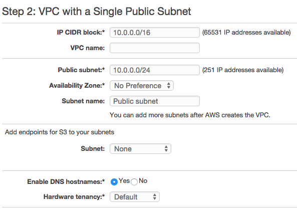

# THE CLUSTERNATOR

## Setup

#### Install the `clusternator` CLI

```
git clone https://github.com/rangle/the-clusternator.git
cd the-clusternator
npm install . -g
```

Check and see if it installed successfully

```
clusternator --help
```


#### Export AWS keys

```
export AWS_ACCESS_KEY_ID=...
export AWS_SECRET_ACCESS_KEY=...
```

#### Create app definition file

In your project's root folder:

```
clusternator app:new > YOUR_APP_DEFINITION.json
```

### AWS console setup

#### Create VPC
- https://console.aws.amazon.com/vpc/home
  - On the Step 1: Select a VPC Configuration page, ensure that VPC with a Single Public Subnet is selected, and choose Select.



#### Create security group
- Create a security group associated with the VPC you just made

#### Create network interface
- Create network interface associated with SG you just made


# License

Copyright (c) 2015, rangle.io
All rights reserved.

Redistribution and use in source and binary forms, with or without modification, are permitted provided that the following conditions are met:

1. Redistributions of source code must retain the above copyright notice, this list of conditions and the following disclaimer.

2. Redistributions in binary form must reproduce the above copyright notice, this list of conditions and the following disclaimer in the documentation and/or other materials provided with the distribution.

THIS SOFTWARE IS PROVIDED BY THE COPYRIGHT HOLDERS AND CONTRIBUTORS "AS IS" AND ANY EXPRESS OR IMPLIED WARRANTIES, INCLUDING, BUT NOT LIMITED TO, THE IMPLIED WARRANTIES OF MERCHANTABILITY AND FITNESS FOR A PARTICULAR PURPOSE ARE DISCLAIMED. IN NO EVENT SHALL THE COPYRIGHT HOLDER OR CONTRIBUTORS BE LIABLE FOR ANY DIRECT, INDIRECT, INCIDENTAL, SPECIAL, EXEMPLARY, OR CONSEQUENTIAL DAMAGES (INCLUDING, BUT NOT LIMITED TO, PROCUREMENT OF SUBSTITUTE GOODS OR SERVICES; LOSS OF USE, DATA, OR PROFITS; OR BUSINESS INTERRUPTION) HOWEVER CAUSED AND ON ANY THEORY OF LIABILITY, WHETHER IN CONTRACT, STRICT LIABILITY, OR TORT (INCLUDING NEGLIGENCE OR OTHERWISE) ARISING IN ANY WAY OUT OF THE USE OF THIS SOFTWARE, EVEN IF ADVISED OF THE POSSIBILITY OF SUCH DAMAGE.
