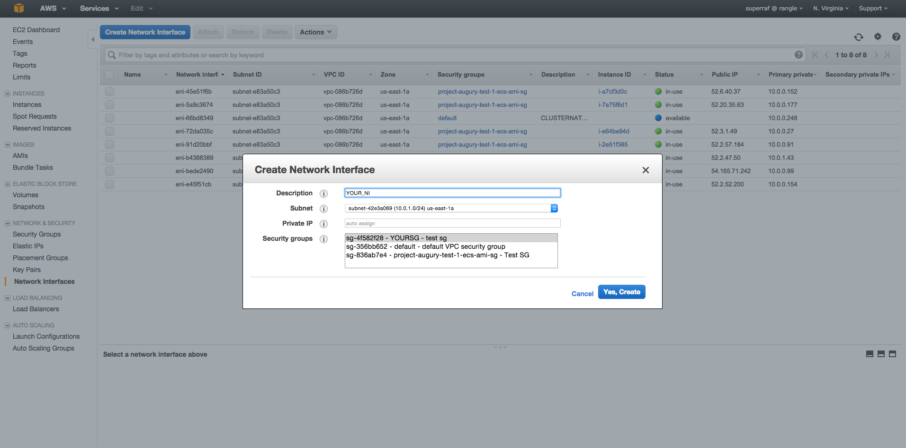
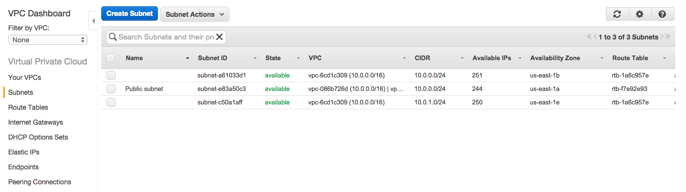
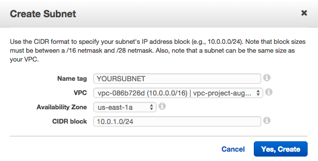

# THE CLUSTERNATOR

## Setup

#### Install the `clusternator` CLI

```
npm install -g clusternator
```

Check and see if it installed successfully

```
clusternator --help
```


#### Export AWS keys

You have to create an Administrator AWS user first.

```
export AWS_ACCESS_KEY_ID=...
export AWS_SECRET_ACCESS_KEY=...
```

#### Create app definition file

In your project's root folder:

```
clusternator app:new > YOUR_APP_DEFINITION.json
```

### AWS console setup

Before being able to launch clusters from the clusternator, you have to
preconfigure the network.

#### Create VPC
- https://console.aws.amazon.com/vpc/home
- https://aws.amazon.com/documentation/vpc/
- On the Step 1: Select a VPC Configuration page, ensure that VPC with a Single Public Subnet is selected, and choose Select.


#### Create security group
- Replace `us-east-1` with your region https://console.aws.amazon.com/ec2/v2/home?region=us-east-1#SecurityGroups
- http://docs.aws.amazon.com/AWSEC2/latest/UserGuide/using-network-security.html
- Create a security group associated with the VPC you just made


#### Create network interface
- https://console.aws.amazon.com/ec2/v2/home?region=us-east-1#NIC
- http://docs.aws.amazon.com/AWSEC2/latest/UserGuide/using-eni.html
- Create network interface associated with SG you just made



#### On VPC page, create a subnet
- https://console.aws.amazon.com/vpc/home?region=us-east-1#subnets
- http://docs.aws.amazon.com/AmazonVPC/latest/UserGuide/VPC_Subnets.html

VPC Subnet page:


Create subnet:


Et Voila


#### Create an IAM role for your instances

Create an IAM role called `ecsInstanceRole` with the following:

```
{
  "Version": "2012-10-17",
  "Statement": [
    {
      "Effect": "Allow",
      "Action": [
        "ecs:CreateCluster",
        "ecs:DeregisterContainerInstance",
        "ecs:DiscoverPollEndpoint",
        "ecs:Poll",
        "ecs:RegisterContainerInstance",
        "ecs:Submit*"
      ],
      "Resource": [
        "*"
      ]
    }
  ]
}
```

## App Definition File

This is the _hard part_ (kinda, not really). The application definition file
(which we will call `appdef.json`) is a JSON file which specifies the following
details about how to run your application:

- Docker images running
- Environment variables
- Links between containers
- Physical -> virtual port mappings
- Data volumes and their physical mount points
  (hard drives, can share between containers)
- CPU and RAM on the physical EC2 instance

You can create an `appdef.json` by running `clusternator app:new > appdef.json`.
More information about the parameters can be found at
http://docs.aws.amazon.com/AmazonECS/latest/developerguide/task_definition_parameters.html
 

## Developing Clusternator

_yay contributions!_

All code is in `src/`. The CLI entry point is `bin/clusternatorCli.js`,
but includes from `lib/` (the compile destination).


`bin/clusternatorCli-es5.js` is ultimately what gets run as the CLI
from `bin/clusternator.sh`.


#### Compile ES6

TODO setup watchers

`npm run build` will transform your ES6 source into ES5

#### Running the clusternator CLI

Run `./bin/clusternator.sh` from the root directory.


# License

Copyright (c) 2015, rangle.io
All rights reserved.

Redistribution and use in source and binary forms, with or without modification, are permitted provided that the following conditions are met:

1. Redistributions of source code must retain the above copyright notice, this list of conditions and the following disclaimer.

2. Redistributions in binary form must reproduce the above copyright notice, this list of conditions and the following disclaimer in the documentation and/or other materials provided with the distribution.

THIS SOFTWARE IS PROVIDED BY THE COPYRIGHT HOLDERS AND CONTRIBUTORS "AS IS" AND ANY EXPRESS OR IMPLIED WARRANTIES, INCLUDING, BUT NOT LIMITED TO, THE IMPLIED WARRANTIES OF MERCHANTABILITY AND FITNESS FOR A PARTICULAR PURPOSE ARE DISCLAIMED. IN NO EVENT SHALL THE COPYRIGHT HOLDER OR CONTRIBUTORS BE LIABLE FOR ANY DIRECT, INDIRECT, INCIDENTAL, SPECIAL, EXEMPLARY, OR CONSEQUENTIAL DAMAGES (INCLUDING, BUT NOT LIMITED TO, PROCUREMENT OF SUBSTITUTE GOODS OR SERVICES; LOSS OF USE, DATA, OR PROFITS; OR BUSINESS INTERRUPTION) HOWEVER CAUSED AND ON ANY THEORY OF LIABILITY, WHETHER IN CONTRACT, STRICT LIABILITY, OR TORT (INCLUDING NEGLIGENCE OR OTHERWISE) ARISING IN ANY WAY OUT OF THE USE OF THIS SOFTWARE, EVEN IF ADVISED OF THE POSSIBILITY OF SUCH DAMAGE.
