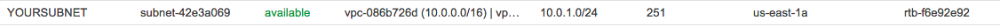
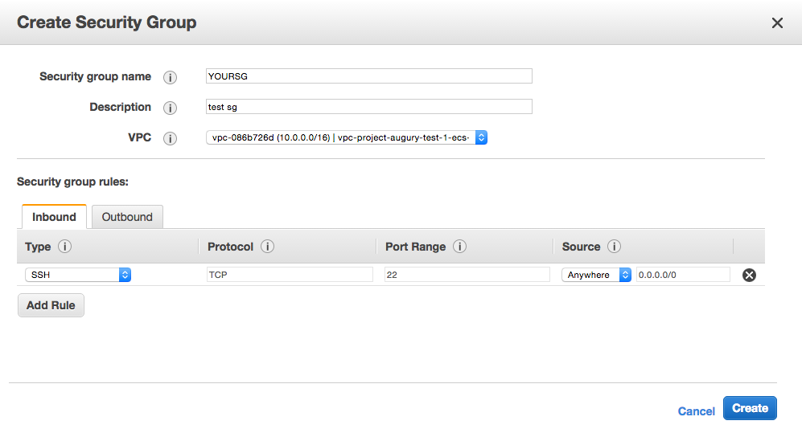

# NETWORK SETUP

Before being able to launch clusters from the clusternator, you have to
preconfigure the network. This is the hard part. A more in depth version
of this page can be found
[here](http://docs.aws.amazon.com/AmazonECS/latest/developerguide/get-set-up-for-amazon-ecs.html)

There are *4 major components* to setting up the network for clusternator.
Documentation for the following steps are found below.
- A **VPC**, this is essentially an isolated block in the AWS cloud, all resources
  will be associated with the VPC
- A **subnet** within the VPC. All the boxes on your cluster will join this.
  Unless you're scaling to several thousand boxes, or have very specific
  security related requirements, only one subnet will be needed.
- A **security group** within the VPC. Each cluster / box can be configured
  to use a different security group. This restricts network access to
  specified IPs, ports, and protocols.
- An **IAM role**. This is a description of permissions the EC2 boxes will have.

rangle.io defaults to `us-east-1` for local projects.

## Create VPC
- https://console.aws.amazon.com/vpc/home
- https://aws.amazon.com/documentation/vpc/
- On the Step 1: Select a VPC Configuration page, ensure that VPC with a Single Public Subnet is selected, and choose Select.

## Create a subnet

You'll do this from the VPC page. Ensure that the VPC matches the one
you created in the first step.

**Take note of the subnet ID, you will need it.** it should look
something like this: `subnet-0f0f0f0f`.

- https://console.aws.amazon.com/vpc/home?region=us-east-1#subnets
- http://docs.aws.amazon.com/AmazonVPC/latest/UserGuide/VPC_Subnets.html

VPC Subnet page:

Create subnet:

Et Voila

## Create security group

Security groups regulate the access to your EC2 instances by port and IP.

**Take note of the security group ID, you will need it** it should look
something like this: `sg-0f0f0f0f`.

- Replace `us-east-1` with your region https://console.aws.amazon.com/ec2/v2/home?region=us-east-1#SecurityGroups
- http://docs.aws.amazon.com/AWSEC2/latest/UserGuide/using-network-security.html
- Create a security group associated with the VPC you just made

## Create an IAM role for your instances

When creating EC2 instances, the clusternator requests an instance role
by name that **should already be created**, this name is hardcoded. It requests
a role called `ecsInstanceRole`. To create the `ecsInstanceRole` IAM role for your container instances do the following:

1. Open the IAM console at https://console.aws.amazon.com/iam/.

2. In the navigation pane, choose Roles and then choose Create New Role.

3. In the Role Name field, type `ecsInstanceRole` to name the role, and then choose Next Step.

4. In the Select Role Type section, choose Select next to the Amazon EC2 Role for EC2 Container Service role.

5. In the Attach Policy section, select the AmazonEC2ContainerServiceforEC2Role policy and then choose Next Step.

6. Review your role information and then choose Create Role to finish.

You can find out more about IAM roles for EC2 instances
[here](http://docs.aws.amazon.com/AWSEC2/latest/UserGuide/iam-roles-for-amazon-ec2.html).
